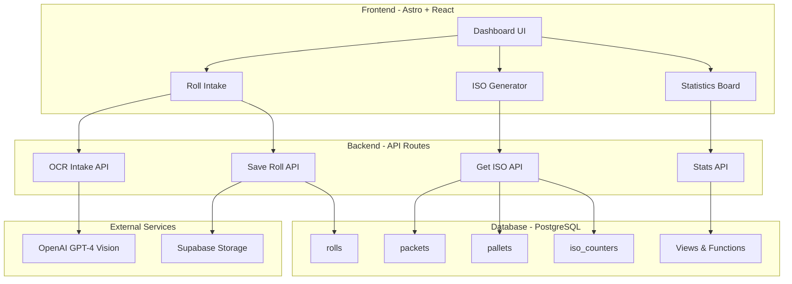
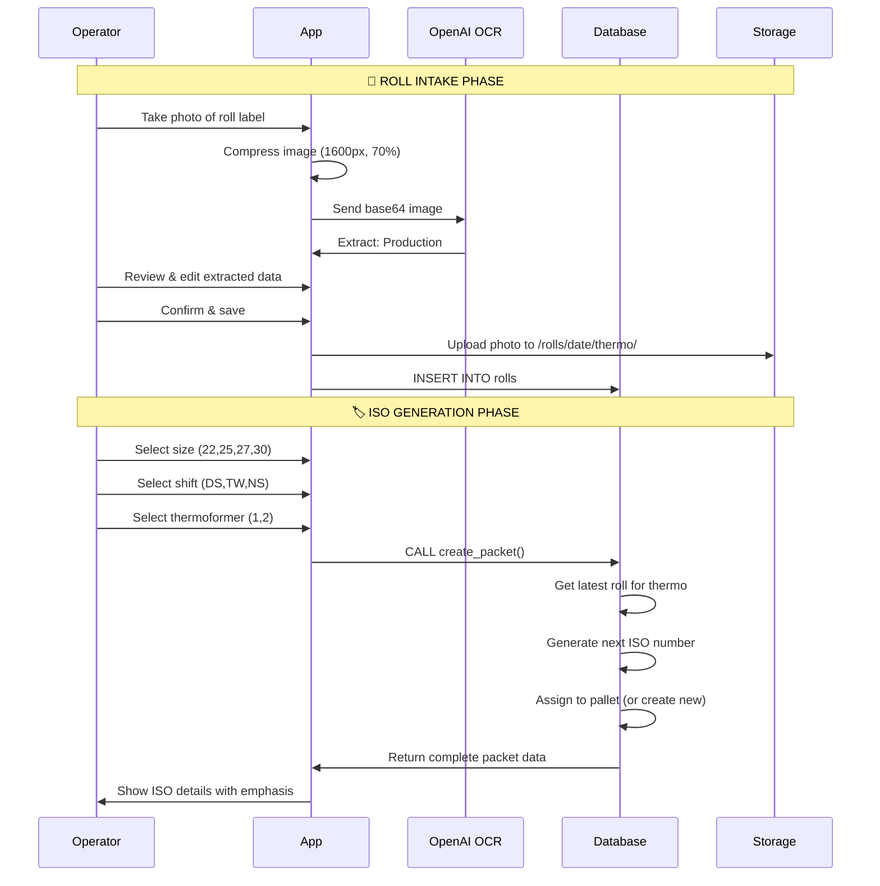

# 🏭 Plixies Thermoformer Dashboard

> **Sistema de gestión integral para producción de thermoformers con trazabilidad completa de materiales, generación automática de ISOs y análisis de producción en tiempo real.**

[](https://astro.build/)
[](https://react.dev/)
[](https://www.typescriptlang.org/)
[](https://supabase.com/)
[](https://tailwindcss.com/)

---

## 📋 Índice

- [🎯 **Características principales**](#-características-principales)
- [🏗️ **Arquitectura del sistema**](#️-arquitectura-del-sistema)
- [🗄️ **Base de datos y estructura**](#️-base-de-datos-y-estructura)
- [⚡ **Tecnologías utilizadas**](#-tecnologías-utilizadas)
- [🚀 **Instalación y configuración**](#-instalación-y-configuración)
- [📱 **Funcionalidades detalladas**](#-funcionalidades-detalladas)
- [🔧 **API endpoints**](#-api-endpoints)
- [📊 **Análisis y estadísticas**](#-análisis-y-estadísticas)
- [🎨 **Diseño y UX**](#-diseño-y-ux)
- [🔄 **Flujo de producción**](#-flujo-de-producción)
- [⚙️ **Configuración avanzada**](#️-configuración-avanzada)

---

## 🎯 Características principales

### ✨ **Gestión de Producción**
- **Intake de Rolls**: Escaneo OCR con IA para extracción automática de datos de etiquetas
- **Generación de ISOs**: Sistema automático de numeración única por talla con trazabilidad completa
- **Gestión de Pallets**: Asignación automática con seguimiento de posiciones (1-24 packets por pallet)
- **Turnos de trabajo**: Soporte completo para Day Shift, Twilight y Night Shift

### 🔍 **Trazabilidad Completa**
- **Materiales**: Tracking desde Production # hasta producto final
- **Batches**: Control de lotes Caspak con numeración única
- **Cajas**: Seguimiento CTN# con fotografías de evidencia
- **Fechas ISO**: Formato semana.día.año automático (zona horaria Nueva Zelanda)

### 📊 **Analytics en Tiempo Real**
- **Dashboard de estadísticas**: Métricas por thermoformer, turno y período
- **Gráficos interactivos**: Distribución por hora, día y turno
- **KPIs de producción**: Packets totales, pallets activos/cerrados
- **Logs detallados**: Historial completo de producción

---

## 🏗️ Arquitectura del sistema



### 🎨 **Stack Tecnológico**

**Frontend Framework:**
- **Astro 5.x**: Framework híbrido con SSR para performance óptima
- **React 19**: Componentes interactivos con hooks modernos
- **TypeScript**: Type safety completo en todo el proyecto

**Styling & UI:**
- **TailwindCSS 4.x**: Sistema de diseño utility-first responsive
- **Recharts**: Gráficos interactivos para analytics
- **Gradients & Animations**: Diseño moderno con micro-interacciones

**Backend & Database:**
- **Supabase PostgreSQL**: Base de datos robusta con RLS (Row Level Security)
- **Supabase Storage**: Almacenamiento de fotografías de rolls
- **SQL Functions**: Lógica de negocio optimizada en PostgreSQL

**AI & External APIs:**
- **OpenAI GPT-4 Vision**: OCR inteligente para lectura de etiquetas
- **Image Processing**: Compresión automática de imágenes

---

## 🗄️ Base de datos y estructura

### 📊 **Esquema de tablas principales**

```sql
-- Catálogo de tallas disponibles
CREATE TABLE sizes (
  size SMALLINT PRIMARY KEY  -- 22, 25, 27, 30
);

-- Gestión de turnos de trabajo
CREATE TABLE shifts (
  code TEXT PRIMARY KEY,        -- 'DS', 'TW', 'NS'
  label TEXT NOT NULL,         -- 'Day Shift', 'Twilight', 'Night'
  start_time TIME NOT NULL,    -- Hora de inicio
  end_time TIME NOT NULL,      -- Hora de fin
  overnight BOOLEAN DEFAULT FALSE  -- Para turno nocturno
);

-- Rolls de material (intake)
CREATE TABLE rolls (
  id UUID PRIMARY KEY DEFAULT gen_random_uuid(),
  thermoformer_number SMALLINT CHECK (thermoformer_number IN (1,2)),
  raw_materials TEXT NOT NULL,     -- Production #
  batch_number TEXT NOT NULL,      -- Caspak Batch #
  box_number TEXT NOT NULL,        -- CTN#
  photo_path TEXT,                 -- Ruta en Supabase Storage
  created_at TIMESTAMPTZ DEFAULT now()
);

-- Pallets (contenedores de 24 packets)
CREATE TABLE pallets (
  id UUID PRIMARY KEY DEFAULT gen_random_uuid(),
  pallet_number INTEGER NOT NULL UNIQUE,
  size SMALLINT NOT NULL REFERENCES sizes(size),
  thermoformer_number SMALLINT CHECK (thermoformer_number IN (1,2)),
  opened_at TIMESTAMPTZ DEFAULT now(),
  closed_at TIMESTAMPTZ  -- NULL = abierto, con valor = cerrado
);

-- Packets (ISOs individuales)
CREATE TABLE packets (
  id UUID PRIMARY KEY DEFAULT gen_random_uuid(),
  
  -- Identidad ISO única
  iso_number INTEGER NOT NULL,
  size SMALLINT NOT NULL REFERENCES sizes(size),
  UNIQUE (size, iso_number),  -- ISO único por talla
  
  -- Trazabilidad completa
  thermoformer_number SMALLINT CHECK (thermoformer_number IN (1,2)),
  raw_materials TEXT NOT NULL,
  batch_number TEXT NOT NULL,
  box_number TEXT NOT NULL,
  
  -- Organización
  shift TEXT NOT NULL REFERENCES shifts(code),
  pallet_id UUID REFERENCES pallets(id),
  packet_index SMALLINT CHECK (packet_index BETWEEN 1 AND 24),
  
  -- Metadatos
  roll_id UUID REFERENCES rolls(id),
  user_id UUID REFERENCES auth.users(id),
  created_at TIMESTAMPTZ DEFAULT now(),
  iso_date TEXT  -- Formato: "36.2.25" (semana.día.año)
);
```

### 🔄 **Funciones SQL críticas**

#### **Generación automática de ISOs**
```sql
-- Obtiene el siguiente número ISO para una talla específica
CREATE OR REPLACE FUNCTION get_next_iso(p_size SMALLINT)
RETURNS INTEGER AS $$
  WITH bumped AS (
    INSERT INTO iso_counters(size, last_value)
    VALUES (p_size, 1)
    ON CONFLICT (size) 
      DO UPDATE SET last_value = iso_counters.last_value + 1
    RETURNING last_value
  )
  SELECT last_value FROM bumped;
$$;
```

#### **Gestión de pallets inteligente**
```sql
-- Asigna packet a pallet abierto o crea nuevo si está lleno
CREATE OR REPLACE FUNCTION assign_packet_to_pallet(
  p_size SMALLINT, 
  p_thermo SMALLINT
)
RETURNS TABLE (
  pallet_id UUID,
  pallet_number INTEGER,
  packet_index SMALLINT,
  closed_previous BOOLEAN
);
```

#### **Creación completa de packets**
```sql
-- Función principal que orquesta todo el proceso
CREATE OR REPLACE FUNCTION create_packet(
  p_size SMALLINT,
  p_thermo SMALLINT,
  p_shift TEXT,
  p_user UUID DEFAULT NULL
)
RETURNS TABLE (
  id UUID,
  iso_number INTEGER,
  size SMALLINT,
  -- ... todos los campos necesarios
);
```

### 🔍 **Vistas especializadas**

```sql
-- Vista completa con joins optimizados
CREATE VIEW v_packets_full AS
SELECT 
  p.id,
  p.created_at,
  p.iso_date,
  p.iso_number,
  p.size,
  p.shift,
  p.thermoformer_number,
  p.raw_materials,
  p.batch_number,
  p.box_number,
  pl.pallet_number,
  p.packet_index,
  (p.packet_index || '/24') AS packet_of_24
FROM packets p
LEFT JOIN pallets pl ON pl.id = p.pallet_id
ORDER BY p.created_at DESC;

-- Progreso de pallets abiertos
CREATE VIEW v_open_pallets_progress AS
SELECT 
  pl.pallet_number,
  pl.size,
  pl.thermoformer_number,
  COUNT(p.id)::INT AS packets_in_pallet,
  (24 - COUNT(p.id))::INT AS packets_remaining
FROM pallets pl
LEFT JOIN packets p ON p.pallet_id = pl.id
WHERE pl.closed_at IS NULL
GROUP BY pl.id, pl.pallet_number, pl.size, pl.thermoformer_number
ORDER BY pl.opened_at DESC;
```

---

## ⚡ Tecnologías utilizadas

### 🎯 **Frontend Stack**

| Tecnología | Versión | Propósito |
|------------|---------|-----------|
| **Astro** | 5.13.5 | Framework principal, SSR, file-based routing |
| **React** | 19.1.1 | Componentes interactivos, estado local |
| **TypeScript** | Latest | Type safety, IntelliSense, mejor DX |
| **TailwindCSS** | 4.1.13 | Styling utility-first, responsive design |
| **Recharts** | 3.1.2 | Gráficos interactivos para analytics |

### 🔧 **Backend & Database**

| Tecnología | Propósito |
|------------|-----------|
| **Supabase PostgreSQL** | Base de datos principal con RLS |
| **Supabase Storage** | Almacenamiento de imágenes de rolls |
| **OpenAI GPT-4 Vision** | OCR inteligente para lectura de etiquetas |
| **Astro API Routes** | Endpoints serverless para lógica de negocio |

### 🎨 **Herramientas de desarrollo**

```json
{
  "scripts": {
    "dev": "astro dev",           // Servidor de desarrollo
    "build": "astro build",       // Build de producción  
    "preview": "astro preview"    // Preview del build
  }
}
```

---

## 🚀 Instalación y configuración

### 📋 **Prerrequisitos**

```bash
# Node.js 18+ requerido
node --version  # v18.0.0+
npm --version   # 9.0.0+
```

### ⚡ **Instalación rápida**

```bash
# 1. Clonar el repositorio
git clone https://github.com/JorgeGdev/thermoformer.git
cd thermoformer

# 2. Instalar dependencias
npm install

# 3. Configurar variables de entorno
cp .env.example .env.local
```

### 🔐 **Configuración de variables de entorno**

Crear archivo `.env.local` con:

```bash
# Supabase Configuration
SUPABASE_URL=https://tu-proyecto.supabase.co
SUPABASE_SERVICE_ROLE=tu_service_role_key

# OpenAI para OCR
OPENAI_API_KEY=sk-tu-api-key-de-openai

# Opcional: Para desarrollo
PUBLIC_SUPABASE_ANON_KEY=tu_anon_key
```

### 🗄️ **Configuración de base de datos**

1. **Crear proyecto en Supabase**
2. **Ejecutar el SQL completo** (proporcionado en el archivo adjunto):

```sql
-- Ejecutar todo el contenido del archivo "SQL code complete.txt"
-- Esto incluye:
-- ✅ Tablas principales (sizes, shifts, rolls, pallets, packets)
-- ✅ Contadores automáticos (iso_counters, pallet_counter)
-- ✅ Funciones SQL (get_next_iso, assign_packet_to_pallet, create_packet)
-- ✅ Vistas optimizadas (v_packets_full, v_open_pallets_progress)
-- ✅ Triggers para iso_date automático
-- ✅ Políticas RLS para seguridad
```

3. **Configurar Storage para imágenes**:
   - Crear bucket llamado `rolls`
   - Configurar políticas públicas de lectura
   - Permitir uploads autenticados

### 🚀 **Ejecutar el proyecto**

```bash
# Desarrollo
npm run dev      # http://localhost:4321

# Producción
npm run build    # Genera ./dist/
npm run preview  # Preview del build
```

---

## 📱 Funcionalidades detalladas

### 🎯 **1. Dashboard principal**

**Ubicación**: `/` (Home)
**Descripción**: Página de bienvenida con navegación principal

```typescript
// Sidebar navigation
const navigation = [
  { name: 'Home', href: '/' },
  { name: 'Intake', href: '/intake' },
  { name: 'Get ISO', href: '/iso' },
  { name: 'Stats', href: '/stats' }
];
```

### 📸 **2. Roll Intake (Ingreso de materiales)**

**Ubicación**: `/intake/thermoformer-1` y `/intake/thermoformer-2`

#### **Funcionalidades:**
- **📱 Escaneo móvil**: Captura de cámara optimizada para dispositivos móviles
- **🤖 OCR con IA**: Extracción automática usando GPT-4 Vision
- **🖼️ Compresión de imágenes**: Optimización automática a 1600px / 70% calidad
- **✏️ Edición manual**: Corrección de datos antes de guardar

#### **Proceso de OCR:**

```typescript
// Compresión de imagen antes de envío
const resizedBase64 = await resizeImageFile(file, 1600, 0.7);

// Llamada a API con prompt específico
const prompt = `
Read the roll label image. Extract these fields ONLY:
- "Production #"   -> raw_materials  
- "Caspak Batch #" -> batch_number
- "CTN#"           -> box_number

Return STRICT JSON: {"raw_materials":"","batch_number":"","box_number":""}
`;
```

#### **Campos extraídos:**
- **Production #**: Número de producción (raw_materials)
- **Caspak Batch #**: Número de lote (batch_number)  
- **CTN#**: Número de caja (box_number)
- **Foto**: Almacenada en Supabase Storage con ruta organizada

### 🏷️ **3. Generación de ISOs**

**Ubicación**: `/iso/{size}` (22, 25, 27, 30)

#### **Características:**
- **🎯 Selección de talla**: 22, 25, 27, 30
- **⏰ Gestión de turnos**: Day Shift, Twilight, Night Shift
- **🏭 Dual thermoformer**: Soporte para ambas máquinas
- **🔢 Numeración automática**: ISOs únicos por talla

#### **Proceso de generación:**

```typescript
async function createISO(thermoformer: 1 | 2) {
  const response = await fetch("/api/get-iso", {
    method: "POST", 
    body: JSON.stringify({ size, thermoformer, shift })
  });
  
  // Respuesta incluye:
  // - ISO number único
  // - Pallet assignment automático  
  // - Packet position (1-24)
  // - Trazabilidad completa
}
```

#### **🎨 Modal de resultado rediseñado:**

**Jerarquía visual:**
1. **🌟 ISO NUMBER**: Centro absoluto, texto gigante (4xl), gradiente verde
2. **📏 SIZE**: Segundo nivel, gradiente azul, centrado  
3. **📋 Campos secundarios**: Grid organizado con colores distintivos:
   - **Shift**: Amarillo (amber-300)
   - **Thermo**: Cian (cyan-300)
   - **Pallet**: Púrpura (purple-300)
   - **Packet**: Naranja (orange-300)
   - **ISO Date**: Índigo (indigo-300)

### 📊 **4. Sistema de estadísticas**

**Ubicación**: `/stats/thermoformer-{1|2|all}`

#### **KPIs principales:**
- **Packets totales** en el período
- **Pallets activos** (en progreso)
- **Pallets completados** (cerrados)

#### **Gráficos interactivos:**
- **Por hora**: Distribution temporal detallada
- **Por día**: Tendencias de producción  
- **Por turno**: Comparación DS/TW/NS

#### **Tabla de producción:**
```typescript
interface ProductionLog {
  iso_number: number;
  thermoformer_number: 1 | 2;
  raw_materials: string;
  batch_number: string; 
  box_number: string;
  size: number;
  shift: 'DS' | 'TW' | 'NS';
  pallet: number | null;
  packet_of_24: string;  // "5/24"
  date: string;          // "2025-09-08"
  time: string;          // "14:30"
}
```

#### **Filtros disponibles:**
- **Rango temporal**: Today / Week / Month
- **Thermoformer**: 1, 2, o Both
- **Actualización automática** al cambiar filtros

---

## 🔧 API endpoints

### 📋 **Resumen de endpoints**

| Endpoint | Método | Propósito |
|----------|--------|-----------|
| `/api/ping` | POST | Health check |
| `/api/ocr-intake` | POST | OCR de etiquetas con IA |
| `/api/save-roll` | POST | Guardar roll + foto |
| `/api/get-iso` | POST | Generar nuevo ISO |
| `/api/stats` | POST | Obtener estadísticas |

### 🤖 **OCR Intake API**

**Endpoint**: `POST /api/ocr-intake`

**Input**:
```typescript
{
  imageBase64: string  // Imagen en base64 (sin data URI prefix)
}
```

**Output**:
```typescript  
{
  raw_materials: string,    // Production #
  batch_number: string,     // Caspak Batch # (solo dígitos)
  box_number: string,       // CTN# (solo dígitos)
  _debug: {
    sizeKB: number,         // Tamaño imagen procesada
    durationMs: number      // Tiempo de procesamiento
  }
}
```

**Características técnicas**:
- **Timeout**: 20 segundos máximo
- **Límite de imagen**: 1.5MB (1500KB) 
- **Modelo**: GPT-4o-mini para cost efficiency
- **Compresión**: Automática con validación
- **Error handling**: Responses informativos

### 💾 **Save Roll API** 

**Endpoint**: `POST /api/save-roll`

**Input**:
```typescript
{
  thermoformer_number: 1 | 2,
  raw_materials: string,     // Production #
  batch_number: string,      // Caspak Batch #  
  box_number: string,        // CTN#
  photoBase64?: string       // Opcional: imagen base64
}
```

**Proceso interno**:
1. **Validación** de campos requeridos
2. **Upload de imagen** a Supabase Storage con nombre estructurado:
   ```
   rolls/2025-09-08/thermo1/25020430_33693_931_143022.jpg
   ```
3. **Inserción en DB** con referencia a photo_path
4. **Generación de URL pública** si el bucket es público

**Output**:
```typescript
{
  ok: true,
  id: string,              // UUID del roll creado
  created_at: string,      // Timestamp ISO
  photo_path: string | null,
  photo_public_url: string | null
}
```

### 🏷️ **Get ISO API**

**Endpoint**: `POST /api/get-iso`

**Input**:
```typescript
{
  size: 22 | 25 | 27 | 30,
  thermoformer: 1 | 2,
  shift: 'DS' | 'TW' | 'NS',
  user_id?: string          // Opcional
}
```

**Proceso interno** (vía función SQL `create_packet`):
1. **Validación** de parámetros
2. **Búsqueda del último roll** del thermoformer
3. **Generación de ISO único** por talla (contador atómico)
4. **Asignación de pallet** (abierto o nuevo si lleno)
5. **Cálculo de posición** (1-24 dentro del pallet)
6. **Creación del packet** con trazabilidad completa

**Output**:
```typescript
{
  success: true,
  packet: {
    id: string,
    iso_number: number,           // Único por size
    size: number,
    shift: string,
    thermoformer_number: number,
    raw_materials: string,        // Del último roll
    batch_number: string,
    box_number: string,
    pallet_number: number,        // Asignado automáticamente
    packet_index: number,         // 1-24
    iso_date: string,            // "36.2.25" formato NZ
    created_at: string
  }
}
```

### 📊 **Stats API**

**Endpoint**: `POST /api/stats`

**Input**:
```typescript
{
  thermo: '1' | '2' | 'all',    // Filtro por thermoformer
  range: 'day' | 'week' | 'month'  // Rango temporal
}
```

**Output estructurado**:
```typescript
{
  ok: true,
  kpis: {
    packetsTotal: number,       // Total en el rango
    palletsActive: number,      // Pallets abiertos
    palletsClosed: number       // Pallets completados
  },
  charts: {
    hourly: Array<{hour: string, count: number}>,
    daily: Array<{day: string, count: number}>, 
    shifts: Array<{shift: string, count: number}>
  },
  table: Array<ProductionLogEntry>  // Para tabla detallada
}
```

---

## 📊 Análisis y estadísticas

### 📈 **KPIs principales**

#### **Métricas de producción**
- **Packets por período**: Total de ISOs generados
- **Eficiencia por turno**: Comparación DS/TW/NS  
- **Utilización de pallets**: Ratio activos/cerrados
- **Throughput por thermoformer**: Producción individual

#### **Análisis temporal**  
- **Distribución horaria**: Picos y valles de producción
- **Tendencias diarias**: Patrones de trabajo
- **Comparación semanal**: Performance histórica

### 📊 **Gráficos interactivos (Recharts)**

```typescript
// Configuración de gráficos base
const ChartConfig = {
  responsive: true,
  cartesianGrid: { strokeDasharray: "3 3", opacity: 0.2 },
  tooltip: { 
    contentStyle: { 
      backgroundColor: '#0B1020',
      border: '1px solid rgba(255,255,255,0.1)'
    }
  },
  bars: {
    dataKey: "count",
    fill: "#3B82F6"  // Blue-500
  }
};
```

#### **Tipos de visualización**:
1. **Bar Charts**: Distribución por hora/día/turno
2. **Responsive Container**: Adaptación automática a pantalla  
3. **Custom Tooltip**: Información contextual
4. **Theme Integration**: Colores coherentes con dark mode

### 🔍 **Tabla de logs detallada**

**Columnas mostradas**:
- ISO#, Thermo, Raw Materials, Batch#, Box#
- Size, Shift, Pallet#, Packet position
- Date, Time (formato local)

**Características**:
- **Font mono** para códigos numéricos
- **Hover effects** para mejor UX  
- **Overflow scroll** horizontal en móviles
- **Color coding** por tipo de dato

---

## 🎨 Diseño y UX

### 🌓 **Sistema de temas**

**Dark mode por defecto** con toggle manual:
```css
:root { 
  color-scheme: light dark; 
}

/* Colores principales */
.bg-primary { @apply bg-white dark:bg-black; }
.text-primary { @apply text-slate-900 dark:text-slate-100; }
.border-primary { @apply border-slate-200 dark:border-slate-800; }
```

### 📱 **Responsive design**

**Breakpoints utilizados**:
- **Mobile first**: Base design para 375px+
- **sm**: 640px+ (tablets portrait)
- **lg**: 1024px+ (desktop)

**Componentes responsive**:
```typescript
// Ejemplo: Layout de botones
<div className="grid grid-cols-1 sm:grid-cols-2 lg:grid-cols-4 gap-5">
  {/* Buttons adapt from stacked to 2x2 to 4x1 */}
</div>

// Sidebar colapsible en móviles
<aside className="w-56 shrink-0 border-r hidden lg:block">
```

### 🎯 **Touch-friendly interfaces**

**Botones optimizados para móvil**:
```css
.btn-big {
  /* 110px height para fácil touch */
  height: 110px;
  
  /* Visual feedback */
  @apply active:scale-[0.98] transition;
  
  /* Gradientes para depth */
  background: linear-gradient(to right, 
    theme('colors.blue.500'),
    theme('colors.blue.600'), 
    theme('colors.blue.700')
  );
}
```

### ✨ **Micro-interacciones**

**Estados de loading**:
- Botones con spinner integrado
- Skeleton screens para tablas
- Progressive enhancement

**Visual feedback**:  
- Hover effects sutiles
- Active states con scale
- Color transitions suaves
- Focus rings para accesibilidad

### 🎨 **Sistema de colores**

**Paleta principal**:
```css
/* Brand colors */
--blue-primary: theme('colors.blue.600');
--green-success: theme('colors.green.600');
--red-error: theme('colors.red.500');

/* UI colors */
--bg-card: theme('colors.slate.50') dark:theme('colors.slate.950');
--border-subtle: theme('colors.white.10');
```

**Colores semánticos en modal ISO**:
- **ISO Number**: Verde (éxito, protagonista)
- **Size**: Azul (información secundaria)
- **Shift**: Amarillo (tiempo)
- **Thermo**: Cian (máquina)
- **Pallet**: Púrpura (contenedor)
- **Packet**: Naranja (posición)

---

## 🔄 Flujo de producción

### 📋 **1. Proceso completo paso a paso**



### 🏭 **2. Gestión de pallets inteligente**

```typescript
// Lógica de asignación de pallets
function assignPacketToPallet(size: Size, thermo: Thermoformer) {
  // 1. Buscar pallet abierto para esta combinación
  const openPallet = findOpenPallet({ size, thermo });
  
  if (openPallet && openPallet.packets < 24) {
    // 2a. Hay espacio - asignar siguiente posición
    return {
      palletId: openPallet.id,
      palletNumber: openPallet.number,
      packetIndex: openPallet.packets + 1
    };
  } else {
    // 2b. No hay pallet o está lleno
    if (openPallet?.packets === 24) {
      // Cerrar pallet completo
      closePallet(openPallet.id);
    }
    
    // Crear nuevo pallet
    const newPallet = createPallet({ size, thermo });
    return {
      palletId: newPallet.id,
      palletNumber: newPallet.number,
      packetIndex: 1  // Primera posición
    };
  }
}
```

### 📊 **3. Trazabilidad de extremo a extremo**

**Desde roll hasta ISO**:
```
Roll Label Photo
    ↓ OCR Extraction  
Production# + Batch# + CTN#
    ↓ Database Storage
Roll Record (ID: uuid)
    ↓ Reference in Packet
ISO Generation
    ↓ Complete Traceability
Final Product ISO with:
- Unique ISO number per size
- Original raw materials data  
- Batch and box numbers
- Photo evidence
- Timestamp and shift
- Pallet and position
- NZ timezone date format
```

### ⏰ **4. Gestión de turnos y fechas**

**Turnos definidos**:
```sql
-- Configuración en base de datos
INSERT INTO shifts VALUES
  ('DS', 'Day Shift', '06:00', '14:30', false),
  ('TW', 'Twilight Shift', '14:30', '23:00', false),  
  ('NS', 'Night Shift', '23:00', '06:00', true);  -- overnight=true
```

**Formato de fecha ISO automático**:
```sql  
-- Trigger que calcula: semana.día.año (zona horaria NZ)
CREATE FUNCTION compute_iso_date_nz(ts TIMESTAMPTZ) 
RETURNS TEXT AS $$
  SELECT to_char(
    ts AT TIME ZONE 'Pacific/Auckland', 
    'IW"."ID"."YY'
  );
$$;

-- Ejemplo: "36.2.25" = Semana 36, Martes, 2025
```

---

## ⚙️ Configuración avanzada

### 🚀 **Deployment**

#### **Variables de producción**:
```bash
# Vercel / Netlify deployment
SUPABASE_URL=https://prod-project.supabase.co
SUPABASE_SERVICE_ROLE=prod_service_role_key
OPENAI_API_KEY=sk-prod-key

# Build optimization  
NODE_ENV=production
BUILD_PATH=./dist
```

#### **Build optimizations**:
```javascript
// astro.config.mjs
export default defineConfig({
  output: 'server',  // SSR para API routes
  build: {
    inlineStylesheets: 'auto',
    splitting: true
  },
  vite: {
    plugins: [tailwindcss()],
    build: {
      rollupOptions: {
        output: {
          manualChunks: {
            'react-vendor': ['react', 'react-dom'],
            'chart-vendor': ['recharts']
          }
        }
      }
    }
  }
});
```

### 🔒 **Seguridad y RLS**

#### **Row Level Security en Supabase**:
```sql
-- Políticas para todas las tablas
ALTER TABLE rolls ENABLE ROW LEVEL SECURITY;
ALTER TABLE packets ENABLE ROW LEVEL SECURITY;
ALTER TABLE pallets ENABLE ROW LEVEL SECURITY;

-- Política de lectura abierta (dashboard público)
CREATE POLICY "Allow read access" ON rolls
  FOR SELECT USING (true);

-- Política de escritura (requiere autenticación en futuro)
CREATE POLICY "Allow insert" ON rolls  
  FOR INSERT WITH CHECK (true);
```

### 📊 **Monitoring y logs**

#### **Error tracking**:
```typescript
// Centralized error handling
function handleAPIError(error: any, context: string) {
  console.error(`[${context}] ERROR:`, error?.message);
  
  // En producción: enviar a servicio de monitoring
  // if (process.env.NODE_ENV === 'production') {
  //   sendToSentry({ error, context });  
  // }
  
  return {
    error: error?.message || 'Unknown error',
    context,
    timestamp: new Date().toISOString()
  };
}
```

#### **Performance monitoring**:
```typescript
// API timing
export async function POST({ request }) {
  const start = Date.now();
  
  try {
    // ... lógica de API
    
    return json({ 
      success: true,
      _timing: { duration: Date.now() - start }
    });
  } catch (error) {
    return json({ 
      error: error.message,
      _timing: { duration: Date.now() - start }
    }, 500);
  }
}
```

### 🔧 **Customización**

#### **Agregar nueva talla**:
```sql
-- 1. Agregar a catálogo
INSERT INTO sizes(size) VALUES (35);

-- 2. Inicializar contador  
INSERT INTO iso_counters(size, last_value) VALUES (35, 0);

-- 3. Actualizar TypeScript types
type Size = 22 | 25 | 27 | 30 | 35;  // Agregar 35
```

#### **Configurar nuevo turno**:
```sql
-- Ejemplo: turno de mantenimiento
INSERT INTO shifts VALUES (
  'MT', 'Maintenance', '02:00', '06:00', true
);
```

#### **Personalizar formato ISO date**:
```sql
-- Modificar función si se requiere formato diferente
CREATE OR REPLACE FUNCTION compute_iso_date_custom(ts TIMESTAMPTZ)
RETURNS TEXT AS $$
  -- Ejemplo: formato DD.MM.YY
  SELECT to_char(ts AT TIME ZONE 'Pacific/Auckland', 'DD"."MM"."YY');
$$;
```

---

## 📖 **Comandos útiles**

### 🔧 **Desarrollo**

```bash
# Desarrollo con hot reload
npm run dev

# Verificar tipos TypeScript
npm run astro check

# Build y preview local  
npm run build && npm run preview

# Instalar nueva dependencia
npm install nueva-dependencia
```

### 🗄️ **Base de datos**

```sql
-- Ver estadísticas rápidas
SELECT 
  COUNT(*) as total_packets,
  COUNT(DISTINCT pallet_id) as unique_pallets,
  MAX(created_at) as last_packet
FROM packets;

-- Pallets en progreso
SELECT * FROM v_open_pallets_progress;

-- Producción de hoy
SELECT shift, size, COUNT(*) 
FROM packets 
WHERE created_at::date = CURRENT_DATE 
GROUP BY shift, size;

-- Reset contador de ISO (¡CUIDADO!)
UPDATE iso_counters SET last_value = 0 WHERE size = 22;
```

### 🚀 **Deploy**

```bash
# Build de producción
npm run build

# Deploy a Vercel (ejemplo)
vercel --prod

# Deploy a Netlify (ejemplo)  
netlify deploy --prod --dir=dist
```

---

## 🤝 **Contribución**

### 📝 **Guía de desarrollo**

1. **Fork** el repositorio
2. **Crear rama** para nueva feature: `git checkout -b feature/nueva-funcionalidad`
3. **Commit** cambios: `git commit -m "Add: nueva funcionalidad"`
4. **Push** a la rama: `git push origin feature/nueva-funcionalidad`
5. **Crear Pull Request** con descripción detallada

### 🐛 **Reportar bugs**

**Template para issues**:
```markdown
## 🐛 Bug Report

**Descripción**: Breve descripción del problema

**Pasos para reproducir**:
1. Ir a página X
2. Hacer clic en Y  
3. Observar error Z

**Comportamiento esperado**: Qué debería suceder

**Screenshots**: Si aplica

**Entorno**:
- Browser: Chrome 120
- Device: Desktop/Mobile
- URL: /page-with-issue
```

---

## 📄 **Licencia**

Este proyecto está bajo la **MIT License**.

---

## 👥 **Créditos**

**Desarrollado por**: [Jorge García](https://github.com/JorgeGdev)

**Stack tecnológico**:
- [Astro](https://astro.build/) - Framework principal
- [React](https://react.dev/) - Componentes UI
- [Supabase](https://supabase.com/) - Backend y base de datos
- [TailwindCSS](https://tailwindcss.com/) - Styling
- [OpenAI](https://openai.com/) - OCR con GPT-4 Vision

---

<div align="center">

**🏭 Sistema integral para control de producción thermoformers**

[📖 Documentación](#) • [🐛 Issues](https://github.com/JorgeGdev/thermoformer/issues) • [🚀 Roadmap](#)

Made with ❤️ for manufacturing excellence

</div>
